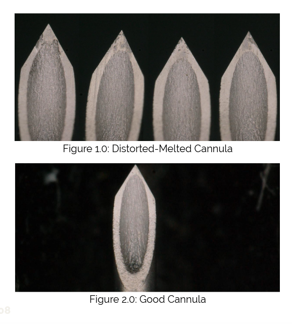
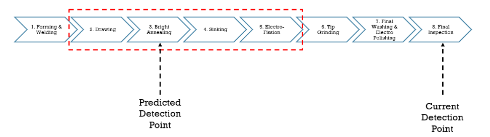
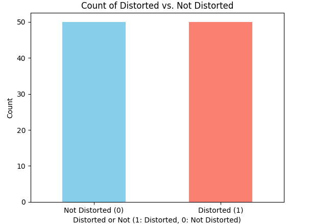
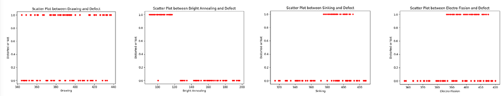

# Predicting Cannula Distorted Defect Based On Hardness Measurement Value

## Problem Statement
Estimated RM300,000 is loss for the year 2024 due to distorted-melted problem of cannula at Cannula Production in B. Braun Medical Industries. Prediction to detect the defect above is vital to save the cost and reduce the loss and wastage. We make a hypothesis that the hardness of material can be a factor to cause distorted-melted of the cannula. The hardness study never been done before in our site. So, decision made to collect data of hardness of the material and compute a machine learning algorithm to do early prediction of the defect before it reaching Final Inspection Process.

## Objective
- To find the relationship between the hardness of material and the defect of distorted-melted.
- To classify the cannula defect of distorted at early stage to reduce loss and wastage.

## Dataset
Y - Defect (Distorted or Not),
X - Input Feature (Hardness reading at Drawing, Bright Annealing, Sinking and Electro Fission)

## Production Process Flow

Above shows the process flow of Cannula Production. There are 4 process where the hardness measurement of the cannula have been taken that are in the red rectangle. With this project we can detect the defect earlier than current detection point thus can reduce the amount of wastage and reduce cost of reprocessing.

## Dataset Limitation
- Our dataset is only limited to 100 data. The limitation for data collection is highly contributed by time taken to conduct measurement at each process (relevant input features). A complete measurement of each Production Order which having 4 input features took 1 to 1.5 hours.
- The challenge includes getting a perfect diamond-shaped onto a 0.55 mm cannula in order to get accurate reading of the hardness value. This can lead to multiple times of adjustments and inadvertently increase the time taken to perform the measurement.
- Being a pilot study, there was no prior data available for hardness measurement value.

## Data Analysis

Analysis of target column shows our dataset is perfectly balance with 50 count of defect and 50 count of non defect.

Scatter plot of hardness measurement value of for 4 features are plot to the target values which is Distorted or Not to find some insight.

- We can observe that the plot are equally distributed along the line in Drawing process. However, In Bright Annealing process, we can observe that there are significant difference in distribution of the plots between 1-Distorted and 0-Not Distorted data. While on Sinking and Defect and also Electro Fission and Defect scatter plot the 1 and 0 and overlapping each other.

## Data Modeling
Data modeling can be seen from following Notebook 

[Predicting_Cannula_Distorted_Defect_Based_On_Hardness](Predicting_Cannula_Distorted_Defect_Based_On_Hardness.ipynb)

